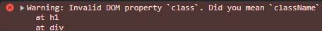

# JSX Attributes & Styling React Elements

- Bu dersin içerisinde JSX ile eklediğimiz HTML öğelerini stillendirmeyi göreceğiz.

- Normalde biz css öğelerimizi uygularken html içerisinde class ile veririz değil mi? Bunu JSX'te yaptığımız zaman css uygulaması çalışıyor evet ama şöyle bir error alıyoruz (geliştirici konsolu içerisinde):  Ancak atladığımı nokta şu, biz JSX ile HTML'i JavaScript'e dönüştürüyoruz dolayısı ile biz HTML'e class değil, DOM üzerinden JavaScript ile HTML'e className veriyoruz. Evet React arka planda "class" yazdığımızda çalışıcak şekilde tasarlanmış olabilir ama doğru kullanım "className" şeklinde olacaktır.

- Tüm bunlara ek olarak javascriptte html'in niteliklerini yazarken düz yazılıyor dahi olsa camelCase kullanmak gerekiyor. Örneğin HTML öğelerine verilen bir özellik olan `contenteditable` jsx içerisinde `contentEditable` şeklinde yazılır.

- *Uzun zamandır unuttuğum bir şeyi burada not alıyorum, CSS sınıflandırmalarında kebab case kullanılır örn:`.img-food`*

- IMG eklerken bunu linki JS içerisinde tutup string olarak HTML'de ekleyebilirsin. Ne de olsa artık böyle bir şansımız var :)